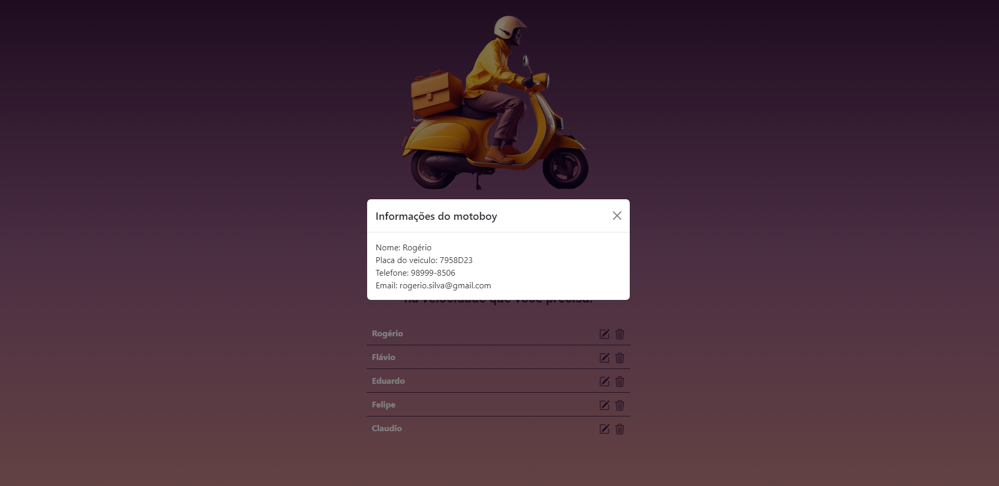

# Desafio MultiPedidos
<h1>
    
    
</h1>

# Indice
- [Sobre](#-sobre)
- [Tecnologias utilizadas](#-tecnologias-utilizadas)
- [Como baixar o projeto](#-como-baixar-o-projeto)

## 🔖&nbsp; Sobre

O projeto consta com o Desafio 1: JavaScript e o Desafio 2: HTML + CSS.

Link da página: https://kellyvasconcellos.github.io/multipedidos-js/

---

## 🚀 Tecnologias utilizadas

O projeto foi desenvolvido utilizando as seguintes tecnologias:

- [HTML](https://developer.mozilla.org/pt-BR/docs/Web/HTML)
- [CSS](https://developer.mozilla.org/pt-BR/docs/Web/CSS)
- [JavaScript](https://developer.mozilla.org/pt-BR/docs/Web/JavaScript)

---

## 🗂 Como baixar o projeto

```bash
    # Clonar o repositório
    $ git clone https://github.com/KellyVasconcellos/multipedidos-js.git
    # Entrar no diretório
    $ cd multipedidos-js
```

---

Desenvolvido 💜 por Kelly Vasconcellos
